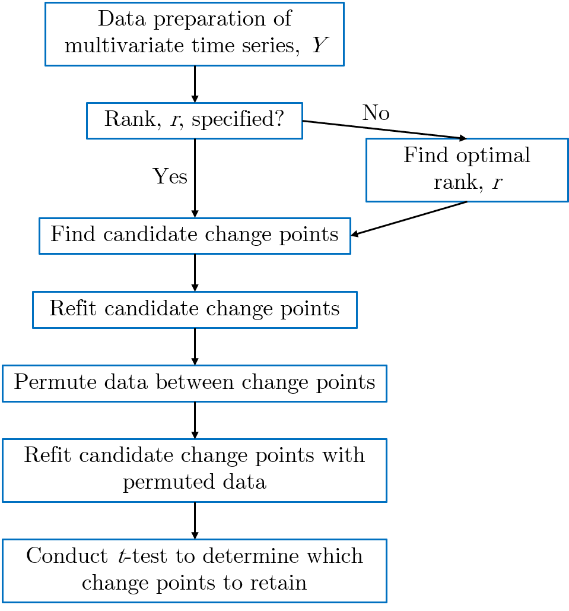

```{r, include = FALSE}
knitr::opts_chunk$set(
  collapse = TRUE,
  comment = "#>"
)
```

# Introduction

```{r setup}
library(FaBiSearch)
```

The purpose of this package is to enable functionality to use **Fa**ctorized **Bi**nary **Search** (FaBiSearch) for change point detection and stationary network estimation in a multivariate time series, $Y$. FaBiSearch and the associated methods are unique in that they utilize non-negative matrix factorization (NMF) for both change point detection and stationary network estimation. The FaBiSearch package depends on the following packages available on CRAN:

* NMF
* doParallel
* foreach
* utils
* parallel

The remainder of this document is outlined as follows - we will first describe the computational workflow for change point detection and network estimation, then we describe the two main functions of this package.

# Computational Workflow


```{r echo=FALSE, out.width='70%', fig.align = 'center'}

```

# Main Functions

There are two main functions which are useful in a multivariate time series context. The first is ```FaBiSearch()``` which is used for change point estimation, and the second is ```estimate_network()``` which is used for estimating an adjacency matrix for network estimation from a stationary multivariate time series.

## Change Point Detection

### Overview

The ```FaBiSearch()``` function enables the discovery of change points in a multivariate time series, $Y$, and in this section we discuss the associated options and hyperparameters for the ```FaBiSearch()``` function. We will also discuss the output table from ```FaBiSearch()```.

The main intuition behind FaBiSearch is that it works to detect changes in clustering structure in $Y$. By evaluating . To improve computational efficiency, FaBiSearch employs a modified binary search method so that the all possible change points do not have to be evaluated and instead find the point of minimum loss, $L$, iteratively. After all candidate change points have been found in a tree-like fashion, we conduct a statistical inference step to determine which change points to retain. Consequently, FaBiSearch is unconstrained to the dimensionality of the original time series $Y$ and thus can be applied for high dimensional problems where the number of variables is in the 100s or 1000s.

### Inputs

Main Options:

* ```output.name```: Name for the output output - note, there is no need to add an extension (e.g. "```.csv```"). All outputs from FaBiSearch will be in a ```.csv``` format. 
* ```data```: Multivariate time series, $Y$, to be analyzed, should be in a matrix format with time points in rows and variables in columns. ```FaBiSearch()``` can also sequentially compute change points across multiple subjects. If the dataset contains multiple subjects, the subjects must be concatenated end to end by rows, that is, after the first subject's matrix ends, the next row is the second subject's first time point, and so on and so forth.
* ```which.subj```: Which subjects to analyze in a vector format (e.g., 1:4 to analyze subjects 1 to 4). If left unspecified, then all subjects are considered.
* ```n.subj```: Total number of subjects in the dataset. If there is only one subject to anaylze, please specify 1.

Algorithm Hyperparameters:

* ```min.dist```: The minimum distance between change points. The choice of this parameter comes from the need to have a large enough block to utilize NMF for. Typically, a value of at least 30 is preferable, and a good starting point to use is around 50.
* ```n.rep```: Number of repetitions for bootstrapping procedure. This is how many times NMF will be run for the original and permuted blocks in order to determine which change points to keep. A value of at least 100 is recommended, but 1000 is preferred.
* ```alpha```: Significance level cutoff for deciding whether to retain change points or not (e.g., 0.05 or 0.01). Used during the statistical inferencing step of the algorithm.
* ```method.rank```: Specifies whether to find rank using optimization procedure (specify "optimal") or use a predetermined rank (integer value, e.g., 4). Intuitively, this hyperparameter can be chosen based on the number of unique clusters in the dataset. Generally, it is recommended that rank is overestimated as this leads to more accurate change point detection.
* ```n.runs```: Number of times to run the NMF algorithm with a random start. Given the iterative way NMF is calculated, it is recommended that multiple runs are used to ensure a stable and satisfactory solution. 
* ```alg.type```: Type of algorithm to use for NMF calculations. By default, this is set to "brunet", however other options exist. Please consult the NMF package vignette or check ?nmf for more details, under "method".
* ```test.type```: Option on how to run the $t$-test for statistical inference, "t-test" for simple $t$-test (using ```alpha```, returns ```TRUE/FALSE```), or "pval.t-test" to return the probability value for the $t$-test (no cutoff)

### Output

The ```FaBiSearch()``` function returns a ```.csv``` table containing . Note that after each subject is completed, the ```.csv``` file is overwritten so that if a problem arises after a subject has already been calculated, this table is not lost. The following columns are in the output:

* ```subject```: subject number
* ```rank.selection```: method used to determine rank
* ```n.rank```: rank used for NMF and the change point estimation process
* ```number.runs```: number of runs used for NMF and the change point estimation process
* ```T.split```: time point where change point was detected
* ```significant```: either the $p$ value of the change point, or a boolean ```TRUE/FALSE``` whether this change point is kept using ```alpha``` as the cutoff value
* ```repetitions```: number of bootstrap repetitions for inference step
* ```algorithm.type```: type of algorithm used by the NMF function
* ```subject.compute.time```: time, in minutes, to compute change points for the corresponding subject

## Stationary Network Estimation

### Overview

The ```estimate_network()``` function enables the estimation of stationary networks in a multivariate time series, $Y$, and in this section we discuss the associated options and hyperparameters for this function. We will also discuss the output matrix from ```estimate_network()```.

We present two ways in which we can estimate a sparse adjacency matrix from a multivariate time series using NMF, both of which begin by calculating the clustering consensus matrix from the multivariate time series $Y$.

### Inputs

Main Options:

* ```data```: Stationary multivariate time series, $Y$, to be analyzed, should be in a matrix format with time points in rows and variables in columns. 
* ```alg.type```: Type of algorithm to use for NMF calculations. By default, this is set to "brunet", however other options exist. Please consult the NMF package vignette or check ?nmf for more details, under "method".
* ```method```: Either "cluster" to use hierarchical clustering on the consensus matrix, or "cutoff" to use a cutoff value for the consensus matrix.

Algorithm Hyperparameters:

* ```n.runs```: Number of times to run the NMF algorithm with a random start. Given the iterative way NMF is calculated, it is recommended that multiple runs are used to ensure a stable and satisfactory solution. 
* ```n.rank```: Intuitively, this hyperparameter can be chosen based on the number of unique clusters in the dataset. Generally, it is recommended that rank is overestimated as this leads to more accurate change point detection. We further recommend that the same rank used for change point detection is specified here.
* ```lambda```: Threshold parameter, relates to the number of clusters if method = "cluster", or a value between 0 and 1 (inclusive) if method = "cutoff". Used to enforce sparsity of the adjacency matrix.

### Output

The ```estimate_network()``` function returns an adjacency matrix, or matrix of boolean values if two nodes share an edge (1) or not (0). 

# Supporting Functions

The main ```FaBiSearch()``` function is built in a modular manner, and the associated supporting functions which it utilizes are included here for transparency.

## Data Preparation

The ```data_setup()``` function is used to organize subjects from the original input data matrix. It returns a list of subjects where each element in the list contains the associated multivariate time series for that subject.

### Inputs

* ```data```: Multivariate time series, $Y$, to be analyzed, should be in a matrix format with time points in rows and variables in columns.
* ```n.subj```: Total number of subjects in the dataset. If there is only one subject to anaylze, please specify 1.
* ```T```: Length of each subject's time series in the dataset.

### Output

A list of original data, $Y$, where each element in the list is a subject and their associated multivariate time series.

## Finding Optimal Rank

If the rank, $r$, to use for ```FaBiSearch()``` has been left unspecified, then this will be determined using this function. The function sequentially evaluates loss for the original dataset as well as a randomly permuted version of the dataset. The optimal rank is the first point where the decrease in loss by increasing $r$ for the original dataset is less than the permuted dataset.

### Inputs

* ```curr.subj```: Multivariate time series data, $Y$, from the current subject.
* ```n.runs```: Number of times to run the NMF algorithm with a random start. Given the iterative way NMF is calculated, it is recommended that multiple runs are used to ensure a stable and satisfactory solution. 
* ```alg.type```: Type of algorithm to use for NMF calculations. By default, this is set to "brunet", however other options exist. Please consult the NMF package vignette or check ?nmf for more details, under "method".

### Output

An integer denoting the optimal rank for that subject.

## Finding Change Points

The ```split_all()``` function is used to find candidate change points in the multivariate time series $Y$. 

### Inputs

* ```data``` Multivariate time series, $Y$, to be analyzed, should be in a matrix format with time points in rows and variables in columns.
* ```split.index``` Empty vector for saving results.
* ```lower``` Lower limit of the data, usually 1.
* ```upper``` Upper limit of the data, or the number of time points in the dataset.
* ```x``` Index set of time series data.
* ```min.dist``` The minimum distance between change points. The choice of this parameter comes from the need to have a large enough block to utilize NMF for. Typically, a value of at least 30 is preferable, and a good starting point to use is around 50.
* ```n.runs```: Number of times to run the NMF algorithm with a random start. Given the iterative way NMF is calculated, it is recommended that multiple runs are used to ensure a stable and satisfactory solution.
* ```n.rank``` Rank value for NMF calculation.
* ```alg.type```: Type of algorithm to use for NMF calculations. By default, this is set to "brunet", however other options exist. Please consult the NMF package vignette or check ?nmf for more details, under "method".

### Output

Dataframe of two columns, "T.split" which denotes the time of the candidate change point and "chg.loss" which denotes the change in loss from splitting the data at the respective candidate change point.

## Refitting Procedure

After FaBiSearch has been exhausted and the candidate change points have been detected, a refitting procedure through the ```refit_splits()``` function is carried out which considers the fact that multiple change points might have been detected.

### Inputs

* ```orig.splits```: Matrix of candidate change points ```T.split``` and the change in loss ```chg.loss```.
* ```curr.subj```: Multivariate time series, $Y$, to be analyzed, should be in a matrix format with time points in rows and variables in columns.
* ```x```: Index set of time series data.
* ```n.rep```: Number of repetitions for bootstrapping procedure. This is how many times NMF will be run for the original and permuted blocks in order to determine which change points to keep. A value of at least 100 is recommended, but 1000 is preferred.
* ```n.rank```: Rank value for NMF calculation.
* ```alg.type```: Type of algorithm to use for NMF calculations. By default, this is set to "brunet", however other options exist. Please consult the NMF package vignette or check ?nmf for more details, under "method".

### Output

List where each element is a unique change point and contains a vector of loss values from the refitted NMF calculations.

## Permutation

To determine whether to keep the candidate change points, we compare the distribution generated during the refitting step to a reference distribution. To do so, we use the ```permute_split()``` first take the partition associated with each candidate change point and permute this section accross time points to effectively disrupt the temporal organization of the clustering structure.

### Inputs

* ```data```: Multivariate time series, $Y$, to be analyzed, should be in a matrix format with time points in rows and variables in columns.

### Output

Original dataset except permuted across rows.

## Permutation Fitting

We take the permuted data set from the permutation step and fit NMF like in the refitting procedure to generate a reference distribution for each change point.

### Inputs

* ```orig.splits```: Matrix of candidate change points ```T.split``` and the change in loss ```chg.loss```.
* ```curr.subj```: Multivariate time series, $Y$, to be analyzed, should be in a matrix format with time points in rows and variables in columns.
* ```x```: Index set of time series data.
* ```n.rep```: Number of repetitions for bootstrapping procedure. This is how many times NMF will be run for the original and permuted blocks in order to determine which change points to keep. A value of at least 100 is recommended, but 1000 is preferred.
* ```n.rank```: Rank value for NMF calculation.
* ```alg.type```: Type of algorithm to use for NMF calculations. By default, this is set to "brunet", however other options exist. Please consult the NMF package vignette or check ?nmf for more details, under "method".

### Output

List where each element is a unique change point and contains a vector of loss values from the permuted NMF calculations.

## Statistical Inference

We use the ```perm_distr()``` function to conduct a one-sided, two sample $t$-test assuming unequal variances between the two distributions (the original and permuted) for statistical inference. This function determines the probability that the mean of the original distribution is less than the permuted distribution. 

### Inputs

* ```orig.splits```: Matrix of candidate change points ```T.split``` and the change in loss ```chg.loss```.
* ```refit.splits```: List of refitted split loss values.
* ```perm.distr```: List of permuted split loss values.
* ```alpha```: Cuttoff value for statistical inference (e.g., 0.05 or 0.01).
* ```test.type```: Type of statistical test to run, "t-test" for simple t-test (using ```alpha```, returns ```TRUE/FALSE```), or "pval.t-test" to return the probability value for the t-test (no cutoff).

### Output

A matrix with columns ```T.split``` for the position of the candidate change point, and ```significant``` for result of the two sided $t$-test.
